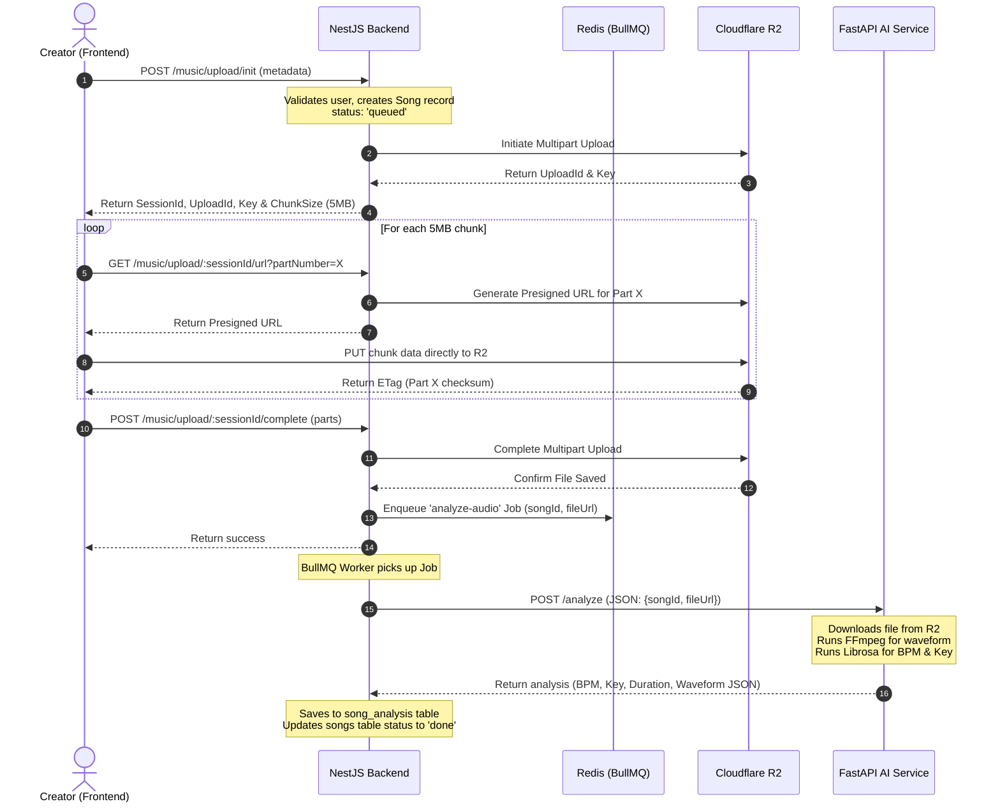

# Thiết kế Hệ thống Music Upload — Sprint 2

Tài liệu đặc tả kiến trúc kỹ thuật và kế hoạch thiết kế cho mô-đun Tải nhạc (Music Upload) tích hợp Cloudflare R2, hàng đợi NestJS BullMQ và dịch vụ phân tích âm thanh FastAPI AI Service (Librosa & FFmpeg).

---

## 1. Mục tiêu (Goals)
*   **Upload tệp tin lớn (lên tới 500MB):** Hỗ trợ tệp định dạng `.mp3`, `.wav`, `.flac`.
*   **Tải lên an toàn:** Client tải trực tiếp lên Cloudflare R2 thông qua các Presigned URLs (S3 Multipart Upload) để giảm tải cho máy chủ NestJS.
*   **Xử lý hậu kỳ bất đồng bộ:** Tách biệt tác vụ nặng (nhận diện BPM/Key, trích xuất Waveform) sang hàng đợi Redis (BullMQ) kết nối FastAPI AI Service chạy trong Docker Container.

---

## 2. Kiến trúc & Luồng Dữ liệu (Architecture & Data Flow)



---

## 3. Đặc tả API Endpoints

### 3.1. NestJS Backend APIs
*   **`POST /music/upload/init`** (Khởi tạo Upload Session)
    *   *Mô tả:* Xác thực người dùng, tạo bản ghi Song tạm trong Postgres với `processingStatus = 'queued'`. Khởi tạo Multipart Upload trên Cloudflare R2.
    *   *Request Body:*
        ```json
        {
          "title": "Summer Breeze",
          "genre": "Synthwave",
          "filename": "summer_breeze.wav",
          "fileSize": 52428800,
          "licenseType": "remix"
        }
        ```
    *   *Response (201 Created):*
        ```json
        {
          "sessionId": "session-uuid",
          "songId": "song-uuid",
          "uploadId": "r2-upload-id",
          "key": "songs/song-uuid/summer_breeze.wav"
        }
        ```

*   **`GET /music/upload/:sessionId/url`** (Lấy Presigned URL cho Chunk)
    *   *Mô tả:* Trả về S3 Presigned URL để Frontend đẩy trực tiếp Chunk nhị phân lên R2.
    *   *Query:* `?partNumber=X`
    *   *Response (200 OK):*
        ```json
        {
          "url": "https://music.7a7c0c77b860c4763bbe740c158511dd.r2.cloudflarestorage.com/..."
        }
        ```

*   **`POST /music/upload/:sessionId/complete`** (Hoàn tất và Đóng Upload)
    *   *Mô tả:* Gọi R2 kết hợp ghép các chunks và đưa Job phân tích âm thanh vào hàng đợi Redis.
    *   *Request Body:*
        ```json
        {
          "parts": [
            { "PartNumber": 1, "ETag": "\"etag_1\"" },
            { "PartNumber": 2, "ETag": "\"etag_2\"" }
          ],
          "songId": "song-uuid"
        }
        ```
    *   *Response (200 OK):*
        ```json
        {
          "success": true,
          "songId": "song-uuid"
        }
        ```

### 3.2. FastAPI AI Service APIs
*   **`POST /analyze`** (Nhận diện & Trích xuất)
    *   *Mô tả:* Gọi bởi NestJS Worker để chạy xử lý âm thanh nặng.
    *   *Request Body:*
        ```json
        {
          "songId": "song-uuid",
          "fileUrl": "https://7a7c0c77b860c4763bbe740c158511dd.r2.cloudflarestorage.com/..."
        }
        ```
    *   *Response (200 OK):*
        ```json
        {
          "songId": "song-uuid",
          "bpm": 124.0,
          "key": "C#m",
          "duration": 182,
          "waveform": [0.012, 0.045, 0.098, 0.12, 0.098, 0.045, 0.012] // Float array (amplitude)
        }
        ```

---

## 4. Đặc tả Môi trường & Đóng gói Docker

### 4.1. Cấu hình Docker cho AI Service (`code/ai-service/Dockerfile`)
Sử dụng image Python cơ bản và cài đặt các nhị phân FFmpeg & Libsndfile:
```dockerfile
FROM python:3.10-slim
RUN apt-get update && apt-get install -y ffmpeg libsndfile1 && rm -rf /var/lib/apt/lists/*
WORKDIR /app
COPY requirements.txt .
RUN pip install --no-cache-dir -r requirements.txt
COPY . .
EXPOSE 8000
CMD ["uvicorn", "main:app", "--host", "0.0.0.0", "--port", "8000"]
```

### 4.2. Docker Compose Update
```yaml
  ai-service:
    build:
      context: ./code/ai-service
    container_name: stemverse-ai-service
    restart: always
    ports:
      - '8000:8000'
    depends_on:
      - redis
```

---

## 5. Đặc tả Giao diện (Frontend - Upload Page)
*   **Địa chỉ:** `/upload`
*   **Metadata Input:** Tiêu đề, Thể loại, Bản quyền, % Remixer split.
*   **File Uploader:** Kéo thả tệp tin âm thanh, tự động chia nhỏ file bằng Javascript `File.slice()` thành từng chunk 5MB.
*   **Hiển thị Tiến trình:** Progress Bar chi tiết hiển thị phần trăm hoàn thành tải lên của từng chunk.
