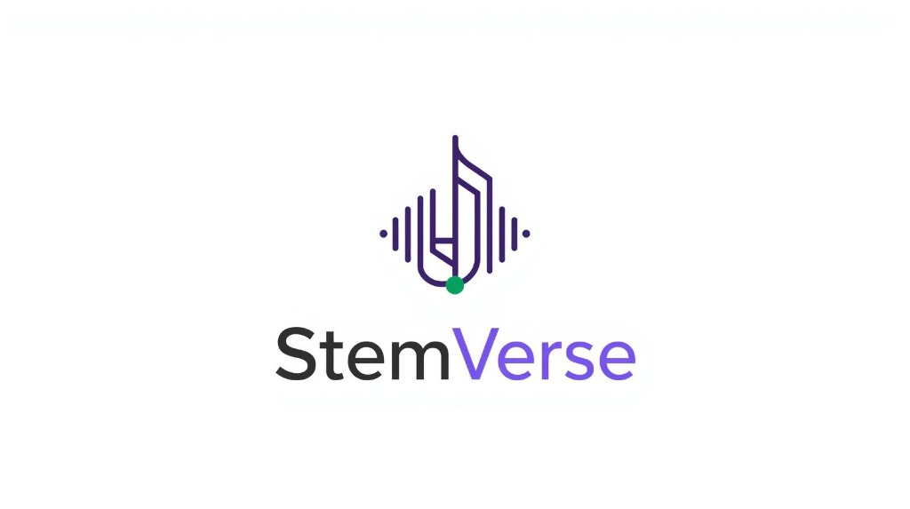

# 🎵 StemVerse



> **"GitHub + Spotify + AI Remix Engine cho âm nhạc"**  
> Nền tảng Quản lý Sở hữu Âm nhạc & Chợ Remix Tích hợp Trí tuệ Nhân tạo.

---

## 🚀 Giới thiệu về StemVerse
StemVerse giải quyết các vấn đề bản quyền và phân chia doanh thu trong văn hóa nhạc remix bằng giải pháp **Sơ đồ quan hệ sở hữu dạng đồ thị (GitHub-style Ownership Graph)**. Nền tảng cho phép:
- 🎵 **Upload** bài nhạc gốc (Full Track + các Stems riêng lẻ như vocal, drums, bass, melody).
- 🤖 **AI Remix** — Chuyển đổi thể loại, tempo, pitch của nhạc bằng Text Prompt thông qua AI.
- 📊 **Ownership Graph** — Tự động thiết lập đồ thị kế thừa khi có bản remix phái sinh.
- 💰 **Auto Royalty** — Tự động phân chia doanh thu trực tiếp cho các nút sở hữu (Creator 70%, Remixer 20%, Platform 10%).
- 🏪 **Marketplace** — Mua bán bản quyền thương mại hoặc phi thương mại cho các bài hát gốc/stems.

---

## 📁 Cấu trúc Thư mục Monorepo

```
Music-Ownership+AI-Remix-Marketplace/
├── .obsidian-vault/                # Knowledge base và tài liệu dự án tập trung (Obsidian)
│   ├── 00-Dashboard/               # Dashboard quản lý & Coding Convention
│   ├── 01-Business/                # Overview, User Roles, Business Rules & Flows
│   ├── 02-SRS/                     # 12 SRS tài liệu đặc tả yêu cầu phần mềm
│   ├── 03-Architecture/            # Thiết kế kiến trúc hệ thống, Frontend, Backend, AI
│   ├── 04-ADR/                     # Architectural Decision Records (Lịch sử quyết định kiến trúc)
│   ├── 05-API/                     # Tài liệu thiết kế API endpoints
│   ├── 06-Database/                # Thiết kế Database ERD
│   ├── 07-Superpowers/             # Nhật ký AI Agent (Brainstorming, Specs, Plans, TDD, Review)
│   ├── 08-Testing/                 # Kế hoạch & Chiến lược kiểm thử
│   ├── 09-Meeting/                 # Ghi chú các cuộc họp thảo luận
│   ├── 10-Prompt-Library/          # Thư viện system prompts cho AI
│   ├── 11-UI-UX-Style-Guideline/   # Hướng dẫn thiết kế giao diện (Design System)
│   ├── 12-MVP-Roadmap/             # Lộ trình phát triển MVP qua các Phase
│   ├── 13-Backlogs/                # Quản lý backlog và nhiệm vụ theo Sprint
│   └── Assets/                     # Logo, sơ đồ và các tài nguyên hình ảnh
│
├── code/                           # Mã nguồn dự án
│   ├── frontend/                   # Ứng dụng Next.js 15 (App Router, TS, Tailwind)
│   └── backend/                    # Ứng dụng NestJS + Prisma ORM
│
├── .superpowers/                   # Cấu hình & Quy trình AI Coding Agent
│   ├── workflows/                  # Quy trình phát triển (Feature, Bug, Refactor, Release)
│   └── *.md                        # Luật code, ngữ cảnh dự án cho AI (Coding, Security, Testing, Review)
│
├── .agent/                         # IDE/Agent Framework (skills tự động của coding agent)
│
├── .cursorrules                    # File chỉ dẫn bắt buộc cho AI Assistant
├── .gitignore                      # File cấu hình bỏ qua git của monorepo
└── README.md                       # Tài liệu tổng quan dự án (File này)
```

---

## ⚙️ Hướng dẫn Khởi chạy (Quick Start)

### 1. Khởi động môi trường Database & Services phụ trợ
Dự án sử dụng Docker để chạy PostgreSQL, Redis và Meilisearch:
```bash
docker compose up -d
```

### 2. Chạy Backend (NestJS API)
```bash
cd code/backend
npm install
npx prisma db push
npx prisma db seed # Nạp dữ liệu mẫu
npm run start:dev
```
Dịch vụ backend sẽ chạy tại cổng mặc định `http://localhost:3001` (hoặc cổng được định nghĩa trong `.env`).

### 3. Chạy Frontend (Next.js 15)
```bash
cd code/frontend
npm install
npm run dev
```
Dịch vụ frontend sẽ chạy tại `http://localhost:3000`.

---

## ⚔️ 3 Điều Luật Sắt (Iron Laws) cho Nhà Phát Triển / AI Agent
Mọi thành viên tham gia code dự án bắt buộc phải tuân thủ:
1. **KHÔNG CÓ SPEC → KHÔNG CÓ CODE**: Tuyệt đối không viết code logic nếu chưa có file thiết kế/đặc tả được mô tả trong [SRS-Overview.md](file:///c:/Users/PC/Desktop/Music-Ownership+AI-Remix-Marketplace/.obsidian-vault/02-SRS/SRS-Overview.md).
2. **KHÔNG CÓ TEST LỖI → KHÔNG CÓ CODE PRODUCTION**: Sử dụng phương pháp phát triển hướng kiểm thử (TDD). Viết test lỗi trước, viết code sau.
3. **BẰNG CHỨNG TRƯỚC - BÁO CÁO SAU**: Mọi báo cáo hoàn thành tính năng phải đính kèm nhật ký chạy test suite thành công 100%.

---

## 👥 Solo Developer
Dự án được xây dựng bởi **Solo Developer** kết hợp với **AI Coding Agent** tuân thủ quy trình phát triển kỷ luật của Superpowers framework.
